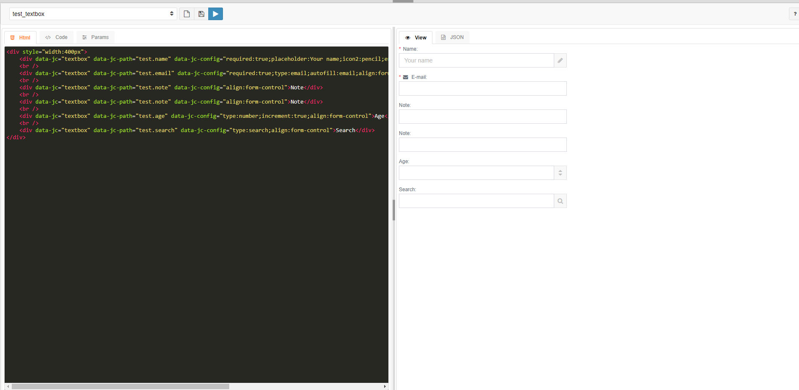

# fabric
**Service for quick form creation**

A small service that makes it easy to create forms and other components. All saved forms are stored in a separate database, after which they can be used in another project. In my projects I constantly use this service.

Uses:
* [jComponent](https://github.com/totaljs/jComponent) 
* **[Download the existing jComponents](https://componentator.com/)** 

Screnshot:

